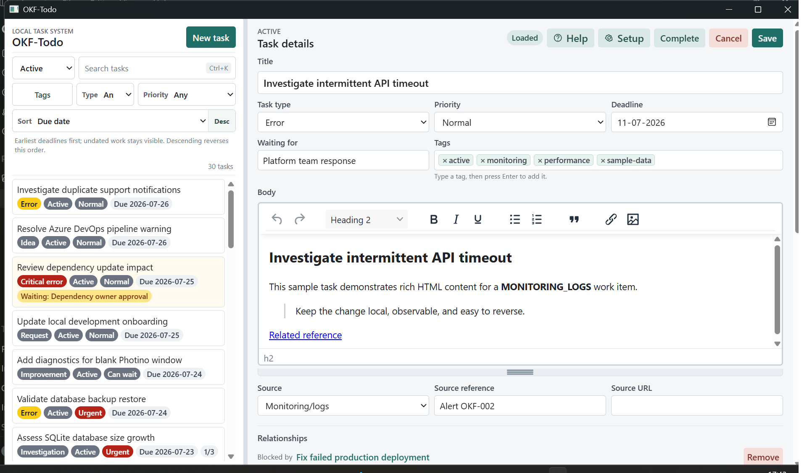

# OKF-Todo

> **Version 0.1 alpha - work in progress.** Expect incomplete features and changes to the user interface. Database will be migrated to newest version if necessary.

An open-source, offline To-Do application for developers and supporters built with SQLite supporting Open Knowledge Format and MCP. 

## AI-First Data

OKF-Todo is designed to help an AI coding harness turn unstructured work into practical artifacts. Give Codex, Claude Code, or another compatible harness a customer mail thread, support transcript, meeting notes, or diagnostic output and ask it to prepare an internal task, investigation plan, customer reply, handover, status update, or other useful artifact.

The recommended workflow is **draft, review, save, verify**: ask the harness to analyze the source without changing anything, review its proposal, explicitly approve any task creation or update, and read the saved result back afterward. Start with the [OKF user guide](docs/help/okf-layer.md) and [MCP user guide](docs/help/mcp-server.md) for complete examples and reusable prompts.

Four complementary access paths support that workflow:

- **[OKF-guided access](docs/help/okf-layer.md):** the repository's [Open Knowledge Format context graph](docs/okf/todo-database/) describes the database concepts, schema, relationships, integrity rules, and lifecycle conventions so an AI can discover and reason about the data before working with SQLite.
- **[MCP server](docs/help/mcp-server.md):** MCP-compatible AI clients can list, read, create, and update tasks and inspect their timelines through structured tools.
- **[CLI commands](docs/okf/todo-database/references/application-command-interface.md):** people, scripts, and agents can execute the same application commands from a terminal.
- **SQLite for inspection:** the application database contains the actual tasks, lookups, comments, history, tags, relationships, images, and attachments.

The AI harness reads the source and generates the artifacts. OKF is its knowledge and navigation layer, MCP is the optional action bridge, and SQLite remains the source of task data. Supported writes should go through the desktop app, CLI, or MCP server so validation, lifecycle rules, and automatic task history run consistently. Direct SQLite access is intended for read-only inspection and diagnostics; direct writes can bypass application behavior.

The same database remains fully usable through the desktop interface. AI assistance is optional, local data stays under the user's control, and no hosted service is required.

The [OKF](docs/help/okf-layer.md) and [MCP](docs/help/mcp-server.md) Markdown guides are also the source for the offline in-app Help. The desktop build copies and renders them locally, so the repository and application guidance stay synchronized.

The CLI and MCP server are thin adapters over the same shared application command service used by the Photino bridge. A task created or updated through any supported interface therefore follows the same business rules and produces the same task history.

[](docs/images/okf-todo-task-workspace.png)

<sub>Data was created by Codex directly.</sub>

## Coming Next

Planned improvements:

- Improved filtering and sorting of tasks.
- Calculation of initial editor height based on screen resolution. 
- Possible inspiration points from MS To Do: Lists, flags and stars
- Installers for Mac and Linux are planned.


It is designed for the work that often falls between formal systems: production errors, support cases, deployment checks, investigations, ideas, notes, requests, and follow-up tasks. The application runs locally, requires no account or cloud service, and keeps tasks, history, images, and attachments together in one SQLite database.

## Product Highlights

- Fast task capture with only a title and task type required.
- Active, urgent, waiting, overdue, completed, and all-task views.
- HTML and Markdown-capable rich-text editors.
- Paste, drop, or select images for task bodies.
- Priorities, deadlines, waiting targets, tags, and optional source references.
- Checklists with progress shown in the task list.
- File attachments stored inside the SQLite database.
- Typed relationships between tasks.
- A combined timeline of comments and automatic change history.
- Editable task types, priorities, and statuses.
- Light and dark color schemes with flexible desktop layouts.
- Complete database backup from inside the application.
- Offline in-app Help for using the OKF layer and optional MCP server.

Windows users can install the self-contained application with [OKF-Todo 0.1.0 for Windows x64](Windows users can install the self-contained application with 

[OKF-Todo 0.1 installer for Windows x64](https://github.com/dalby-md/OKF-Todo/releases/download/latest-alpha/Okf-Todo-0.1-win-x64-setup.exe). 

The installer includes the desktop application and OKF context layer. Installing the MCP server is offered as a user choice and is selected by default.). The installer includes the desktop application and OKF context layer. Installing the MCP server is offered as a user choice and is selected by default. You don't need to be a local administrator to install this.

## Screenshots

[Browse the OKF-Todo screenshot gallery](docs/images/promotional/README.md) to see the workspace, task workflow, offline Help, Preferences, backup, and dark mode. All screenshots use fictional demonstration data.

## Getting Started

### Requirements

The current alpha is run from source. You need. 
- Windows 10 or later, macOS 10.15 or later, or a current Linux desktop distribution.
- If you want to use dotnet builder and runner. You should use [.NET 8 SDK](https://dotnet.microsoft.com/download/dotnet/8.0). 
- The platform webview used by Photino: WebView2 on Windows, the system WebKit view on macOS, or GTK/WebKit on Linux.

Windows is the primary tested platform for version 0.1. The application architecture and Photino shell are cross-platform, but macOS and Linux packaging and verification are still in progress.

### Run the application

Clone the repository, change to its root directory, and run the application using your shell.

For Bash:

```bash
git clone https://github.com/dalby-md/OKF-Todo.git
cd OKF-Todo
dotnet restore
dotnet run --project ./Okf-Todo/Okf-Todo.csproj
```

For Windows Command Prompt:

```cmd
git clone https://github.com/dalby-md/OKF-Todo.git
cd OKF-Todo
dotnet restore
dotnet run --project .\Okf-Todo\Okf-Todo.csproj
```

All following `dotnet` commands in this README assume the current directory is the repository root.

On first launch, OKF-Todo creates its database and initial lookup values automatically. No setup wizard or account is required.

On later releases, pending EF Core migrations are applied automatically before the application reads or writes task data.

The database is stored under the operating system's local application-data directory:

| Platform | Typical database path |
| --- | --- |
| Windows | `%LOCALAPPDATA%\Okf-Todo\okf-todo.db` |
| macOS | `~/Library/Application Support/Okf-Todo/okf-todo.db` |
| Linux | `$XDG_DATA_HOME/Okf-Todo/okf-todo.db`, or `~/.local/share/Okf-Todo/okf-todo.db` when `XDG_DATA_HOME` is unset or relative |

Do not delete this file unless you intentionally want to remove all application data.

### Connect an MCP client

Build the MCP server in the repository root:

```powershell
dotnet build .\Okf-Todo.Mcp\Okf-Todo.Mcp.csproj -c Release
```

Then configure an MCP client to start the built stdio server. For example:

```json
{
  "mcpServers": {
    "okf-todo": {
      "command": "dotnet",
      "args": [
        "C:\\git\\Okf-Todo\\Okf-Todo.Mcp\\bin\\Release\\net8.0\\Okf-Todo.Mcp.dll"
      ]
    }
  }
}
```

Adjust the absolute DLL path for your checkout. By default, the server uses the same platform-specific database as the desktop application. It exposes these tools:

| Tool | Purpose |
| --- | --- |
| `task_list` | List tasks by view. |
| `task_get` | Read one task. |
| `task_create` | Create a task through the shared application command service. |
| `task_update` | Replace a task's editable fields through the shared application command service. |
| `task_get_timeline` | Read comments and automatic task history. |

`task_update` has full-replacement semantics for editable fields. Call `task_get` first and include every value that must be preserved; omitted optional fields are cleared.

For development or isolated tests, start the server with a different database:

```powershell
dotnet run --project .\Okf-Todo.Mcp\Okf-Todo.Mcp.csproj -- --database-path C:\temp\okf-todo-mcp.db
```

The MCP protocol uses standard output. Server and framework logs are written to standard error so they do not corrupt the protocol stream.

### Create your first task

1. Select **New task**.
2. Enter a title and select **Save** in the dialog.
3. Choose the task type. Add priority, deadline, tags, waiting information, or body content as needed.
4. Select **Save** in the task editor.

New tasks start as active. Images and attachments can be added after the task has been saved once.

## User Manual

### Workspace and navigation

The task list is on the left and the selected task is shown in the editor. Drag the divider to resize the list. In stacked layout, the divider adjusts the list height instead.

Use the view buttons to focus the list:

| View | Shows |
| --- | --- |
| **Active** | Current active tasks. |
| **Urgent** | Active tasks with urgent priority. |
| **Waiting** | Active tasks with a waiting target. |
| **Overdue** | Active tasks whose deadline has passed. |
| **Completed** | Completed tasks. |
| **All** | Every task, including cancelled tasks. |

Use **Search tasks** to filter the current view by task details or tag text. The tag filter accepts multiple existing tags and shows tasks having any selected tag. The arrow keys move through the visible task list; **Home** and **End** select its first and last entries.

When you switch tasks with unsaved changes, the application asks whether to save, discard, or keep editing.

### Create and edit tasks

Select **New task** and enter a title. The task opens as a draft using the configured default task type.

The editor supports:

- Title and task type.
- Optional priority and deadline.
- A plain-text **Waiting for** value such as `INC123456`.
- Zero or more string-only tags.
- Rich body content.
- Optional source, source reference, and source URL fields when enabled in settings.

Select **Save** to persist changes. Changes to an existing task are recorded in its timeline.

### Body editor and images

The default HTML editor provides familiar rich-text formatting, lists, quotations, links, undo, redo, and images. Markdown mode provides Markdown and WYSIWYG editing plus formatting tools for headings, lists, links, images, tables, and code.

Choose the preferred editor under **Setup > Editor mode**. This preference applies when tasks are opened and is remembered between sessions.

Images can be pasted, dropped, or selected from the editor. Supported formats are PNG, JPEG, GIF, and WebP, with a maximum size of 5 MB per image. Save a new task before adding images. Image bytes are stored in SQLite rather than as separate files.

### Task lifecycle

Use the action buttons in the task header:

- **Complete** marks an active task as completed.
- **Cancel** marks an active task as cancelled.
- **Reopen** returns a completed or cancelled task to active status.

Completing a waiting task asks whether to clear its waiting target. Lifecycle changes and timestamps are recorded automatically.

Cancelled tasks appear only in **All** and are visually distinguished from active work.

### Waiting targets

Enter any useful text in **Waiting for**, for example a person, team, ticket number, or external dependency. A task can have one active waiting target.

Saving a new value marks the task as waiting while keeping it active. Clearing the field resolves the current waiting target and records the change in the timeline.

### Tags

Use **Tags** to organize tasks with simple text values:

1. Select an existing tag or type a new value.
2. Press **Enter** to attach it.
3. Use the tag chip's remove control to detach it from the task.

Under **Setup > Tags**, tags can be renamed. Unused tags can be permanently deleted. A used tag can be merged into another tag, moving all task associations to the target without creating duplicates.

### Checklists

Add checklist items below the task body. Items can be completed, reopened, edited, reordered, and deleted. Progress is shown as a completed/total count in both the task detail and task list.

Checklist additions and completion changes are recorded in the timeline. Deletion requires confirmation.

### Attachments

Select **Add file** in the Attachments section. Files up to 25 MB are stored directly in the database with their metadata and content.

Use the attachment actions to save a copy or remove the attachment. Removing a file requires confirmation and cannot be undone from the application.

### Task relationships

Relationships are hidden by default. Enable **Setup > Show relationships** to display them.

Choose a relationship type and another task, then select **Add**. Relationship labels are shown from the current task's perspective, such as **Blocks** or **Blocked by**. Select the related task name to navigate to it.

Self-relations and duplicate relations are rejected. Removing a relationship requires confirmation and is logged on both involved tasks.

### Timeline and comments

The Timeline combines:

- Human-written comments.
- Automatic logs for lifecycle and field changes.
- Checklist, attachment, tag, and relationship events.

Enter a comment at the bottom of the task and select **Add**, or press **Ctrl+Enter**. Comments can be permanently deleted after confirmation. Automatic history entries cannot be edited through the normal interface.

### Setup and preferences

Select the gear-shaped **Setup** button to configure:

- HTML or Markdown editor mode.
- Editor height.
- Light or dark color scheme.
- Automatic, side-by-side, or stacked task layout.
- Visibility of source fields and relationships.
- Database backup.
- Task types, priorities, statuses, and tags.

Layout, visibility, editor, and color preferences are restored when the application starts again.

Task types, priorities, and statuses may be renamed, reordered, assigned badge colors, activated or deactivated, and selected as defaults where permitted. Values already used by tasks are retained to protect historical data. System values required by the application cannot be removed or disabled.

### Back up and restore data

Open **Setup**, then select **Back up database**. Choose a destination in the native save dialog. The application creates and validates a complete SQLite backup before replacing the selected destination.

The backup includes tasks, body images, attachments, lookups, tags, relationships, comments, checklists, and history. Interface preferences such as layout and color scheme are stored separately and are not included.

Restore is manual in version 0.1:

1. Close OKF-Todo.
2. Keep a copy of the current database if needed.
3. Replace the platform-specific `Okf-Todo/okf-todo.db` file listed under Getting Started with the backup file.
4. Start OKF-Todo again.

Never replace the active database while the application is running.

## Data and Privacy

OKF-Todo is a single-user, local-first application. It has no authentication, cloud synchronization, application telemetry, or external task-system integration. Application data stays in the local SQLite database unless you create a backup or save an attachment copy yourself.

## Current Limitations

Version 0.1 is an alpha release intended for evaluation and personal use:

- Windows, macOS, and Linux can run from source; Windows currently receives the most testing.
- A Windows installer can be built from the repository. Automatic updates and macOS/Linux packages are not available yet.
- There is no cloud sync or multi-user collaboration.
- Database downgrades are not supported; back up the database before installing an older application version.
- Restore is a manual file-replacement operation.
- Deep integrations with email, ServiceDesk, Teams, and Azure DevOps are not included.

Use the in-application backup command regularly while evaluating the alpha.

## Development

Build the solution:

```powershell
dotnet build -c Release
```

Run the test suite:

```powershell
dotnet test .\Okf-Todo.Tests\Okf-Todo.Tests.csproj -c Release
```

Restore the repository-local EF Core tool and add a migration after changing the physical model:

```powershell
dotnet tool restore
dotnet tool run dotnet-ef migrations add <MigrationName> --project .\Okf-Todo\Okf-Todo.csproj --startup-project .\Okf-Todo\Okf-Todo.csproj --output-dir Migrations
```

Commit the generated migration and model snapshot with the model change. The application applies pending migrations automatically at startup.

Product and architecture documentation is available in [`docs`](docs/).

### Build the Windows installer

The Windows installer is a self-contained `win-x64` Inno Setup package. It always installs the GUI and OKF context graph. **Install MCP server** is presented as an installer component and is selected by default.

Install Inno Setup 7 (or compatible Inno Setup 6), then run from the repository root:

```powershell
.\installer\build-installer.ps1 -Version 0.1.0
```

Or from Windows cmd:

```cmd
installer\build-installer.cmd -Version 0.1.0
```

The installer is written to:

```text
artifacts\installer\Okf-Todo-0.1.0-win-x64-setup.exe
```

To publish, merge, and validate the staging payload without compiling the setup executable:

```powershell
.\installer\build-installer.ps1 -Version 0.1.0 -SkipInstallerCompile
```

The mandatory payload is staged under `artifacts\installer\staging\core`; the optional MCP server and its isolated runtime are staged under `artifacts\installer\staging\mcp`; and the installed OKF bundle is staged under `artifacts\installer\staging\okf`.

For a signed production build, provide the Windows SDK `signtool.exe`, certificate thumbprint, and optional RFC 3161 timestamp URL:

```powershell
.\installer\build-installer.ps1 -Version 0.1.0 `
  -SignToolPath 'C:\Program Files (x86)\Windows Kits\10\bin\10.0.26100.0\x64\signtool.exe' `
  -CertificateThumbprint '<certificate-thumbprint>'
```

The build signs the GUI executable and MCP executable before packaging, then signs the resulting setup executable. Ordinary development builds remain unsigned.
