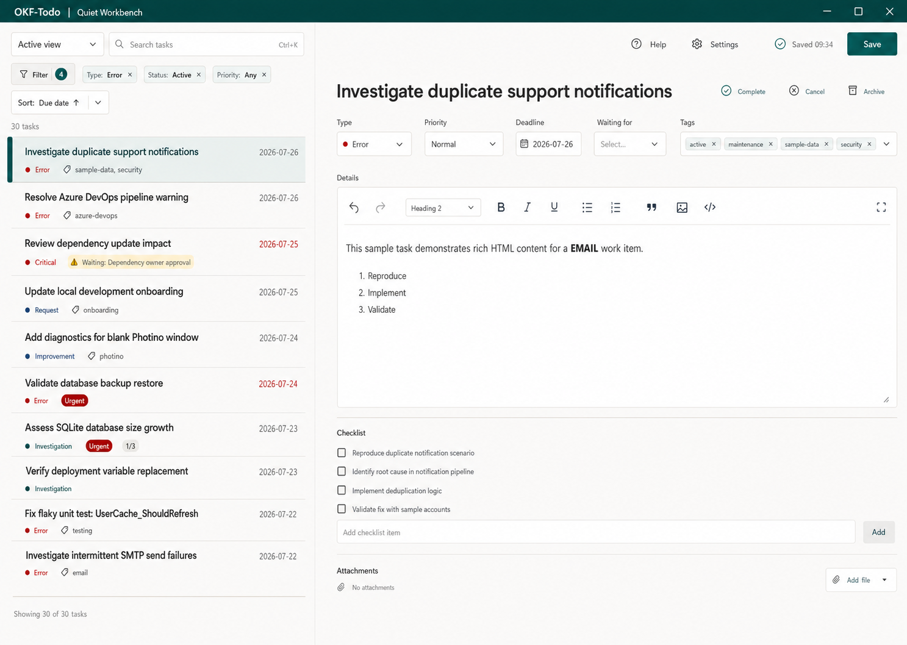
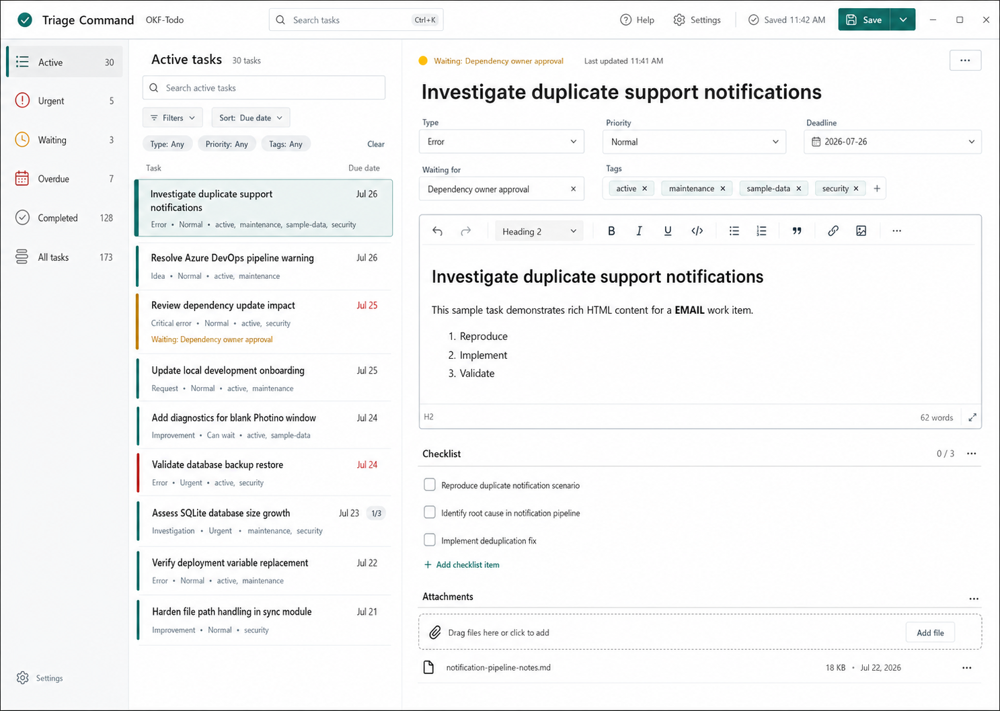
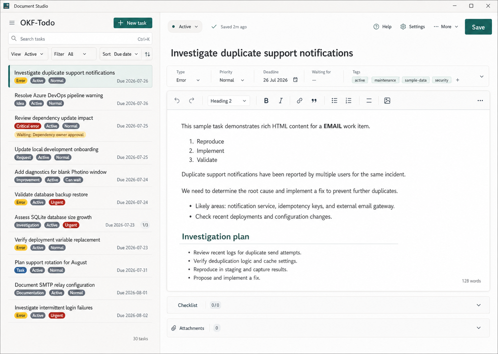

# Main workspace redesign options

These three design directions are stable references for future OKF-Todo work. The
option numbers and names should not be reused for different concepts.

Option 2, **Triage Command**, was selected for implementation on 2026-07-23.
The product name remains **OKF-Todo**; the option names describe design
directions, not product renames.

## Comparison

| Option | Primary strength | Best fit |
| --- | --- | --- |
| 1. Quiet Workbench | Calm, familiar two-pane workflow | Long focused sessions and the smallest departure from the current UI |
| 2. Triage Command | Fast navigation and high-volume triage | Large displays used by developers and support staff |
| 3. Document Studio | Maximum attention on the artifact | Long-form writing, review, and handover work |

## Option 1 — Quiet Workbench

Quiet Workbench keeps the familiar task-list and task-detail split while making
the whole application feel calmer and more deliberate.

- A unified top bar carries the OKF-Todo identity, global actions, and save state.
- A compact, flat task list replaces a stack of visually separate cards.
- The selected task is shown by a restrained accent rail and tonal background.
- The task detail becomes a clean document canvas with metadata grouped above the
  editor.
- Borders are reduced in favour of spacing, alignment, and subtle surface
  changes.
- The direction prioritizes continuity: existing users should understand it
  immediately.

Responsive intent:

- Keep two panes while both the list and editor remain useful.
- Narrow the task list before changing the overall structure.
- Stack the list over the editor on small windows.

Use this option when the product should feel more polished without changing the
mental model of the workspace.

## Option 2 — Triage Command

Triage Command is a three-zone workbench designed for people who repeatedly move
between queues while keeping one task open.

- A persistent task-view rail makes Active, Urgent, Waiting, Overdue, Completed,
  and All immediately available.
- The middle column is a purpose-built triage list with search, Tags, Type,
  Priority, sort, direction, result count, and concise task rows.
- The detail area is a spacious work surface rather than another card.
- A single application bar keeps identity and task actions stable while the
  content changes below it.
- Selected and urgent work uses controlled accent colour; ordinary work remains
  visually quiet.
- Every task view has a stable semantic accent: teal for Active, red for Urgent,
  amber for Waiting, rose for Overdue, green for Completed, and slate for All.
  Labels and icons remain present so meaning never depends on colour alone.
- The implementation preserves OKF-Todo terminology and current filtering
  behaviour even where the concept image uses simplified example labels.

Responsive intent:

- **Full command center (1280 px and wider):** labelled navigation rail, task
  list, resizer, and detail area remain visible together.
- **Compact desktop (901–1279 px):** the navigation rail becomes icon-only with
  tooltips and accessible labels; the list remains resizable.
- **Small window (900 px and narrower):** the rail is removed, the task-view
  selector returns to the list header, and the existing resizable stacked
  list/detail workflow is used.
- **Explicit Stacked preference:** the list height is capped according to the
  available screen height so the task title, metadata, and body editor remain
  immediately useful below it.

This is the selected implementation direction. It works best on large screens,
while the compact and stacked modes preserve the same capabilities rather than
shrinking the large layout until controls are truncated.

## Option 3 — Document Studio

Document Studio treats the task body as the primary artifact and moves supporting
task data into a quieter property system.

- A compact task library supports selection without competing with the document.
- The editor receives the largest share of the window and reads like a writing
  surface.
- Task metadata becomes a concise property strip.
- Checklist, attachments, relationships, ownership, and source information are
  organised as supporting sections around the document.
- The visual hierarchy is optimized for drafting, review, and handover rather
  than rapid queue switching.

Responsive intent:

- Preserve the editor as the dominant surface.
- Collapse the library before compressing the document.
- Move supporting properties into stacked sections on narrow windows.

Use this option if OKF-Todo later develops a stronger emphasis on long-form
artifacts, review flows, or document-centric work.
