# OKF-Todo screenshot gallery

[Return to the project README](../../../README.md)

These screenshots use fictional customer and task data. They were captured from the current production UI at 1280 × 720 and are displayed without forced dimensions.

## 1. Light workspace

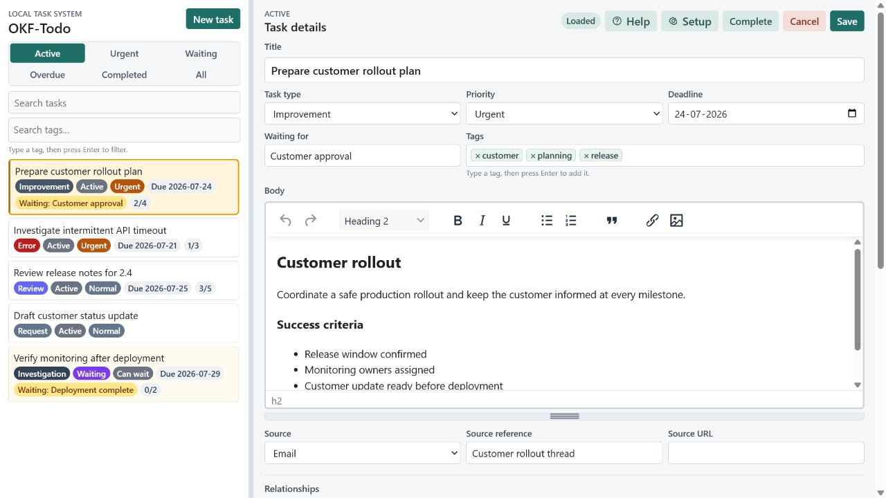

The main workspace combines task views and search with a detailed task editor.

## 2. Task workflow

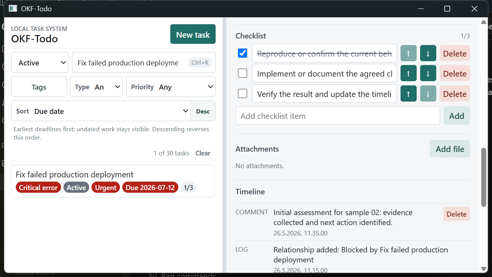

Relationships, checklist progress, attachments, comments, and automatic history remain together with the task.

## 3. OKF layer Help

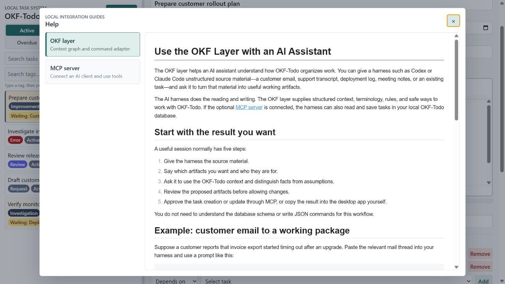

The offline OKF guide explains how an AI harness can turn source material into reviewed artifacts.

## 4. MCP server Help

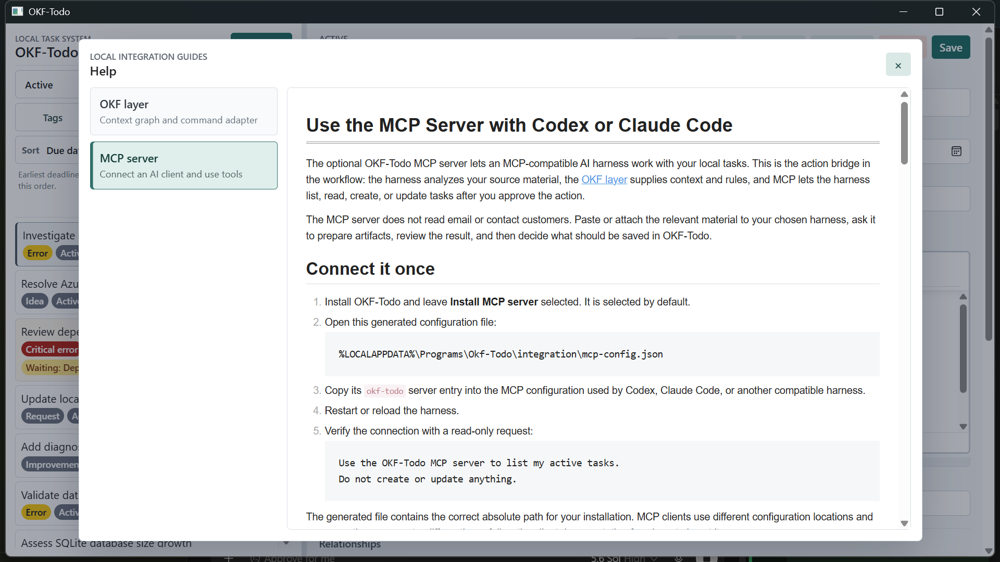

The MCP guide explains the optional local action bridge and its review-before-save workflow.

## 5. Data and values

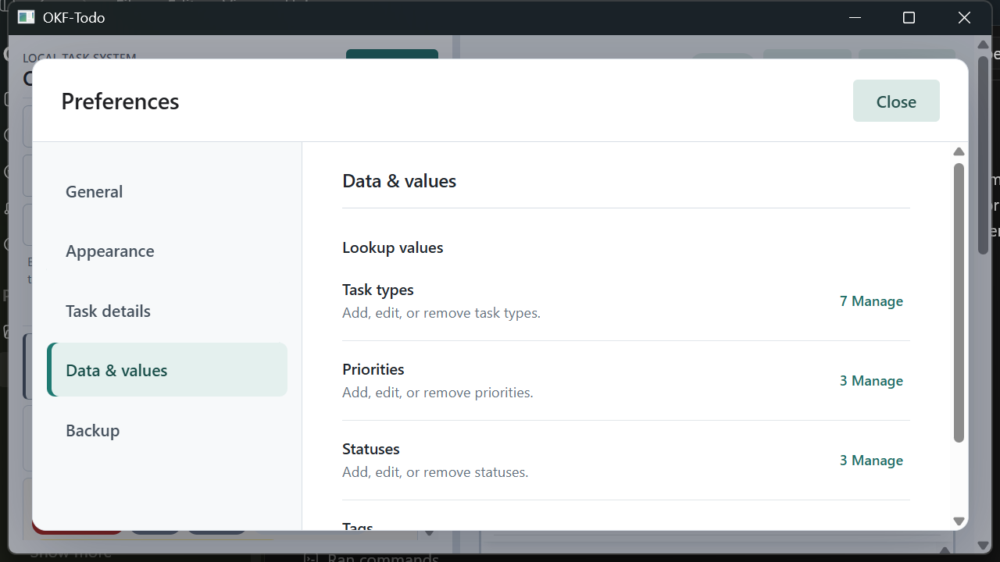

Task types, priorities, statuses, and tags have a dedicated Preferences page.

## 6. Backup

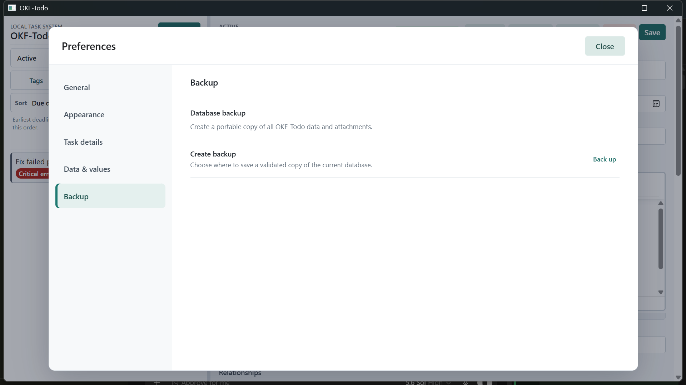

Backup is isolated on its own focused Preferences page.

## 7. Dark-mode preference

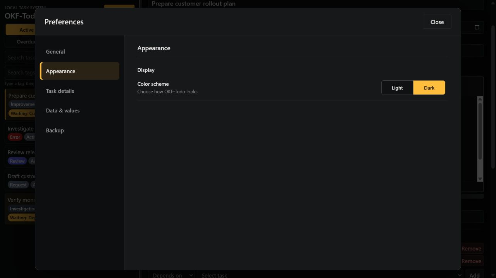

The Appearance page provides an immediate light or dark color-scheme choice.

## 8. Dark workspace

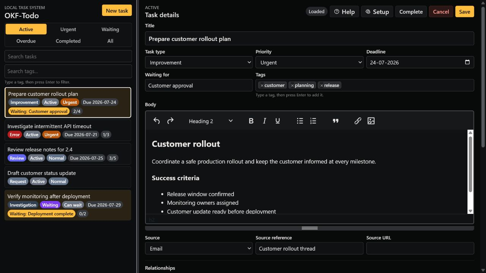

The full workspace remains readable and consistent in dark mode.

## 9. Task details preferences

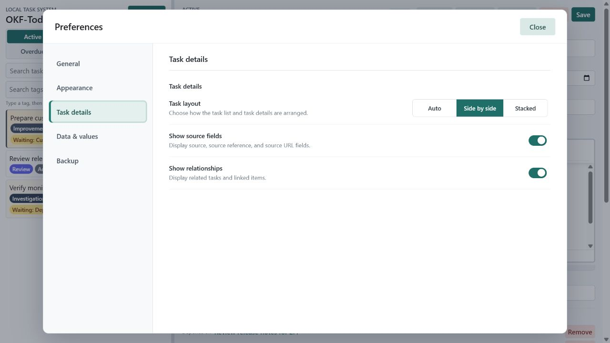

Task layout, source fields, and relationship visibility are grouped on a dedicated Preferences page.

## 10. Help overview

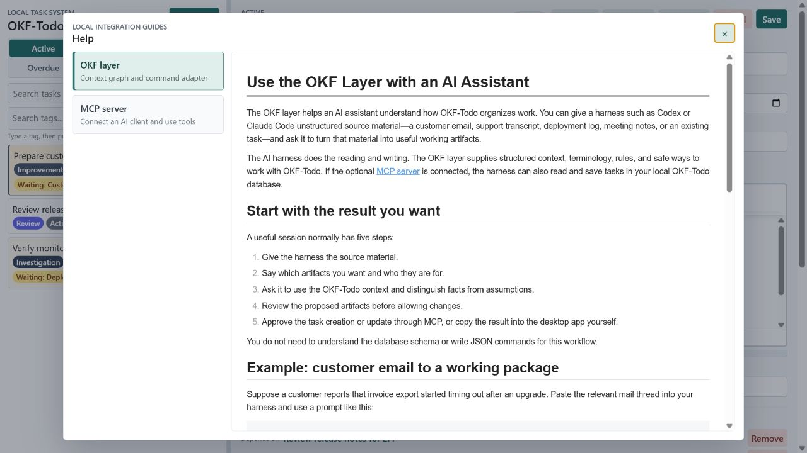

Offline Help keeps the OKF and MCP user guides available directly inside the desktop application.

## 11. Task relationships

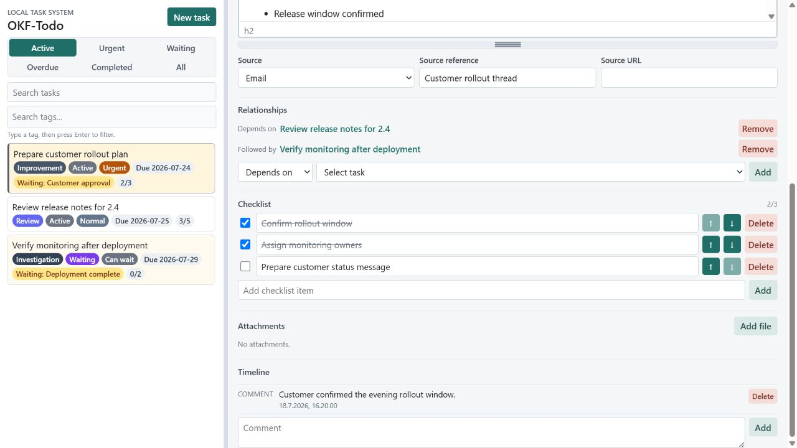

Typed relationships connect related work while keeping checklist progress and timeline context close by.

[Return to the project README](../../../README.md)
